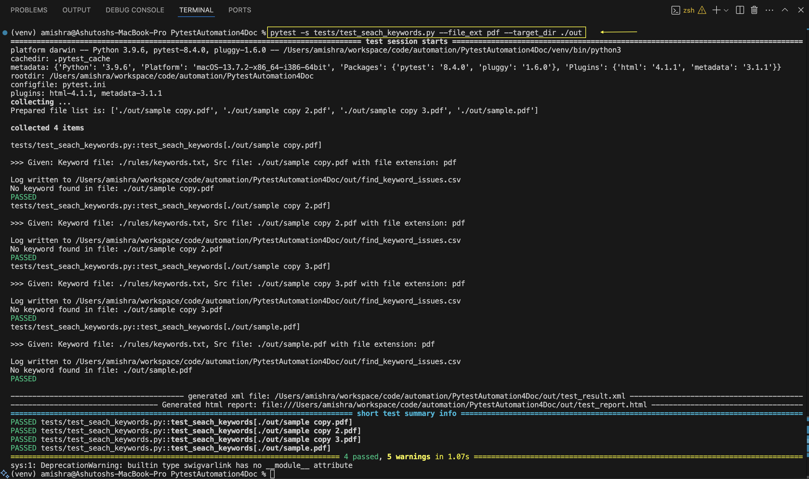

# PytestAutomation4Doc
Pytest automation for the documentation testing

### Pre-Requisite:
<pre>
    1. python3
</pre>

### Setup
<pre>
    1. Clone the repo
        ~ git clone {this_repo_link}
        ~ cd ./PytestAutomation4Doc
    2. Run the requirement (You can also create virtualenv first before installing modules)
        ~ pip install -r requirements.txt
</pre>

### Execution
> `python3 -m pytest` {runs the entire framework test}

> `python3 -m pytest <PATH_TO_TEST_FILE> [ARGS]` {runs the specific test file}

 

Example: 
> `pyton3 -m pytest -s tests/test_seach_keywords.py --file_ext html --target_dir ./out`

> `pyton3 -m pytest -s tests/test_seach_keywords.py --file_ext pdf --target_dir ./out`

> `pyton3 -m pytest -s tests/test_seach_keywords.py --file_ext txt --target_dir ./out`

> `pyton3 -m pytest -s tests/test_seach_keywords.py --file_ext pdf --target_dir ./out --keyword_file ./rules/keywords.txt`

Output:
